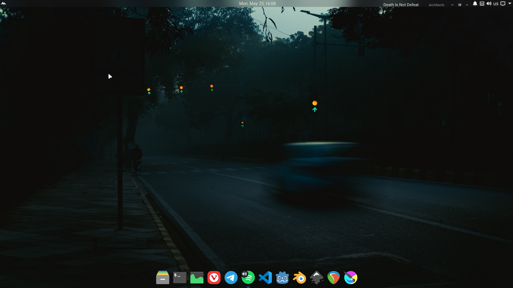
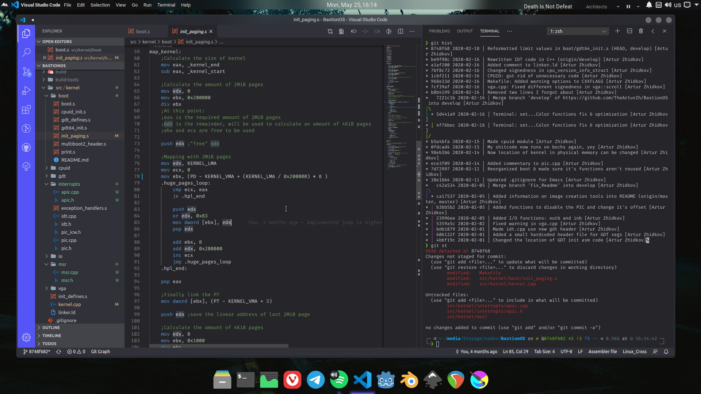
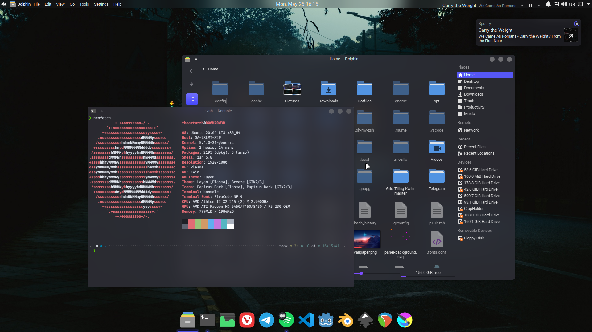

# Dotfiles & Themes

**Distro:** Kubuntu  
**Desktop Environment:** KDE Plasma  
**Theme Engine:** Kvantum  
**Dock:** [Latte Dock](https://github.com/KDE/latte-dock)  
**Plasmoids:** [Chili Clock](https://github.com/MarianArlt/kde-plasmoid-chiliclock), [Window Title Applet](https://github.com/psifidotos/applet-window-title), [Media Controller +](https://github.com/ismailof/mediacontroller_plus)  
**Terminal Emulators:** Konsole and Yakuake  
**Yakuake Skin:** [Materia Light](https://store.kde.org/p/1229144/)  
**Shell:** zsh  
**Shell Theme:** [powerlevel10k](https://github.com/romkatv/powerlevel10k) (via Oh My Zsh)  

 

**Plasma Theme:** Layan (modified - plasma panels are almost completely transparent)  
**Kvantum Theme:** Layan  
[Repository of original theme](https://github.com/vinceliuice/Layan-kde)  
**Icon Theme:** [Papirus Dark](https://github.com/PapirusDevelopmentTeam/papirus-icon-theme)  
**Splash Screen:** [Anti Materia](https://store.kde.org/p/1291717/)  
**Fonts:**  
General: Roboto  
Fixed width: Fira Code [(patched with Nerd Fonts)](https://github.com/ryanoasis/nerd-fonts/tree/master/patched-fonts/FiraCode)  
**Cursor Theme:** [Bibata Ice](https://github.com/KaizIqbal/Bibata_Cursor)  
**Terminal Color Scheme:** modified One Dark  
**Wallpapers:** [Clouds by SouredApple](https://www.newgrounds.com/art/view/souredapple/clouds) and [Free Morning by Dewang Gupta](https://unsplash.com/photos/IBScqPIcigw)  

 

**Code Editor: VSCode**  
Font: Fira Code 13pt  
Icons: [Material Icon Theme](https://marketplace.visualstudio.com/items?itemName=PKief.material-icon-theme) [(GitHub Repository)](https://github.com/PKief/vscode-material-icon-theme)  
Theme: [Layan](https://marketplace.visualstudio.com/items?itemName=xonTAB.layan-theme) [(GitHub Repository)](https://github.com/xontab/layan-vscode-theme)  

## Screenshots
  
  
  
